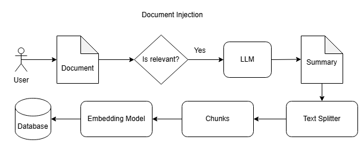

# RAG Concert Tours Information Bot

### Author: Sebastian Albowicz

## Overview
This project implements a **Retrieval-Augmented Generation (RAG)** system designed to provide intelligent responses to user queries by combining document retrieval and generative AI capabilities. The system supports two primary functionalities:
1. **Core RAG Functionality**: Allows users to inject documents into a knowledge base and retrieve relevant information using natural language queries.

2. **Web Search Integration**: Enhances the system by retrieving real-time information about musicians or bands from the web.

The system is built with modular components for document ingestion, retrieval, and response generation, and includes a user-friendly **Streamlit-based UI** for seamless interaction.

## System Design

### 1. **Retrieval-Augmented Generation (RAG)**
- Combines a vector database for document retrieval with a generative language model for response generation.
- Ensures accurate and contextually relevant answers by grounding responses in retrieved documents.

### 2. **Document Ingestion**
- Documents are split into chunks using the **RecursiveCharacterTextSplitter** from LangChain.
- The chunks are stored in a vector database (Chroma) for efficient retrieval.
- Embeddings are generated using the **`all-MiniLM-L6-v2`** model from Hugging Face, which is a lightweight and efficient transformer model for sentence embeddings.



### 3. **Retrieval**
- Queries are matched against the vector database using cosine similarity to retrieve the most relevant document chunks.
- The retrieval process is powered by LangChain's retriever utilities.


### 4. **Response Generation**
- Retrieved documents are passed to a generative language model for response generation.
- The system uses the **Groq LLM** (`llama3-8b-8192`) for generating contextually accurate and detailed responses.

### 5. **Query Classification**
- The system automatically classifies (using LLM) user input as either:
  - **Document Injection**: If the input is a document to be added to the knowledge base.
  - **Question**: If the input is a natural language query seeking information.
- This classification ensures that the system processes the input appropriately, routing it to the correct pipeline (document ingestion or question answering).

### 6. **Web Search Integration**
- Incorporates a web search module to fetch real-time information about musicians or bands, complementing the static knowledge base.
- The system integrates with the **SERP API** to fetch real-time information, which is processed and combined with retrieved documents to generate comprehensive responses.


### 7. **Streamlit UI**
- Provides an intuitive interface for users to interact with the system.
- Features mode selection, input fields, and a toggleable "Info Bar" for guidance.

#### Main UI for Core RAG Functionality
This is the main interface where users can inject documents or ask questions using the Core RAG functionality.


#### Document Injection Example
An example of the UI when injecting a document into the knowledge base.


#### Question Answering Example
An example of the UI when asking a question and receiving a response.


#### Web Search Mode
The interface for performing web searches to retrieve real-time information about musicians or bands.


#### Info Bar
The toggleable "Info Bar" provides guidance and additional information about how to use the system.


### 8. **Centralized Functionality**
- Core functionalities such as document ingestion, retrieval, and response generation are implemented in a single module (`functions.py`) for simplicity and ease of maintenance.
- Additional features, such as web search and vector database setup, are encapsulated in separate modules to ensure separation of concerns and scalability.


## APIs Used

### 1. **Hugging Face API**
- Used for generating embeddings with the `all-MiniLM-L6-v2` model.
- Provides efficient and high-quality sentence embeddings for document retrieval.

### 2. **SERP API**
- Used for real-time web search to fetch information about musicians, bands, and concerts.
- Complements the static knowledge base by providing up-to-date information.

### 3. **Groq API**
- Used for accessing the `llama3-8b-8192` generative language model.
- Powers the response generation process by producing detailed and contextually relevant answers.

### 4. **LangChain API**
- Used for managing the retrieval-augmented generation (RAG) pipeline.
- Provides utilities for document splitting, retrieval, and integration with vector databases.

## Project Structure
```
📦 rag_concert_info_bot
├── 📁 images                       # Images for README ilustrations.
├── 📁 src
│   ├── app.py                      # Main entry point for the RAG system
│   ├── 📁 utils
│   │   ├── functions.py            # Core functions for document ingestion, retrieval and response generation
│   │   ├── online_search.py        # Web search integration for real-time information retrieval
│   │   ├── streamlit_ui.py         # Streamlit-based user interface
│   │   └── vectorstore_setup.py    # Setup and management of the vector database
│   └── 📁 tests
│       ├── test_data.txt           # Example documents and queries for testing
│       └──  test_system.py         # Automated tests for the RAG system
├── requirements.txt                # Lists project dependencies
├── .env                            # Environment variables for configuration
└── README.md                       # Documentation for the project
```


## Setup Instructions

### 1. **Clone the Repository**
```bash
git clone https://github.com/salbowic/rag_concert_info_bot.git
```

### 2. **Install Dependencies**
```bash
pip install -r requirements.txt
```

### 3. **Configure Environment Variables**
Create a `.env` file in the root directory and add the following variables:
```
GROQ_API_KEY=<your_groq_api_key>
HUGGINGFACE_API_KEY=<your_huggingface_api_key>
SERP_API_KEY=<your_serp_api_key>
LANGCHAIN_API_KEY=<your_langchain_api_key>
```

### 4. **Run the Application**
Start the Streamlit UI:
```bash
streamlit run src/app.py
```

## Usage

### 1. **Core RAG Functionality**
- **Add a Document**: Paste a document into the input box to inject it into the knowledge base.
- **Ask a Question**: Enter a natural language query to retrieve relevant information from the knowledge base.

### 2. **Web Search**
- Enter the name of a musician or band to fetch real-time information about upcoming concerts, venues, and other details.

### 3. **Streamlit UI**
- Use the radio buttons to switch between "Core RAG Functionality" and "Web Search."
- The "Info Bar" provides guidance on how to use the system.

## CLI Mode (Command-Line Interface)

The system also includes a **CLI mode** for users who prefer interacting with the bot via the command line. In CLI mode, you can:
- Inject documents into the knowledge base.
- Ask questions to retrieve relevant information.
- Perform web searches for real-time information about musicians or bands.

### How to Run CLI Mode
To run the application in CLI mode, use the following command:
```bash
python src/app.py --cli
```

### Note:
While the CLI mode is available, it is **recommended to use the Streamlit-based UI** for a more user-friendly and interactive experience.

## Testing
- Example documents and queries are provided in `test_data.txt`.
- Run automated tests using:
```bash
python src/tests/test_system.py
```